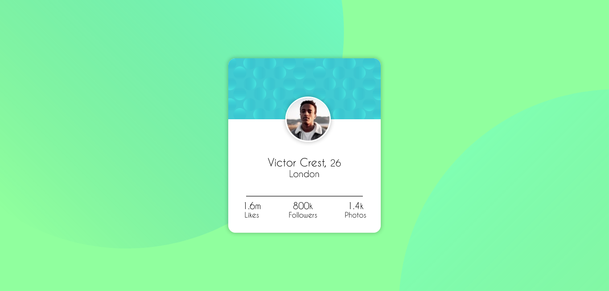

# Frontend Mentor - Profile card component solution

This is a solution to the [Profile card component challenge on Frontend Mentor](https://www.frontendmentor.io/challenges/profile-card-component-cfArpWshJ). Frontend Mentor challenges help you improve your coding skills by building realistic projects. 

## Table of contents

- [Overview](#overview)
  - [The challenge](#the-challenge)
  - [Screenshot](#screenshot)
  - [Links](#links)
- [My process](#my-process)
  - [Built with](#built-with)
  - [What I learned](#what-i-learned)
  - [Useful resources](#useful-resources)
- [Author](#author)

## Overview

### The challenge

- Build out the project to the designs provided

### Screenshot

### Links

- Solution URL: [Add solution URL here](https://your-solution-url.com)
- Live Site URL: [Add live site URL here](https://your-live-site-url.com)

## My process
- Make the background
- I made a card container and tried to make it responsive

### Built with

- CSS custom properties
- Flexbox
- CSS Grid
- [Styled Components](https://tachyons.io/) - For styles

### What I learned

You need to make the position as absolute, relative, fixed, sticky in order for z-index to work :)

### Useful resources

- [resource 1](https://gist.github.com/bartholomej/8415655) - Hellped me figure out media query

## Author

- Frontend Mentor - [@Clupai8o0](https://www.frontendmentor.io/profile/Clupai8o0)
